---
title: "Justice et inégalités en France"  
subtitle: "Séquence d'analyses sur le logiciel R à partir de l’enquête Baromètre et Opinion (enquête réalisée par la DREES et BVA en 2018)"  
author: "L. Gabriel Cruz Saavedra"  
date: "14/02/2020"
output: 
  html_document: 
    code_folding: show
    highlight: tango
    keep_md: yes
    number_sections: yes
    smooth_scroll: yes
    toc: yes
    toc_depth: 4
    toc_float: yes
---  

<br>
<br>
<br>
<br>  

<center>

  
<figcaption>Photographie: Vox Populi 2 - [Charles Urban](http://urbanphotographie.com/) </figcaption>

<br>  

**Résumé**  

L'objectif de ce document est d'illustrer une séquence d'analyses réalisées sur le logiciel R. Les analyses ont été réalisées sur le jeu de données correspondant à l'enquête [Baromètre d'Opinion](http://www.data.drees.sante.gouv.fr/ReportFolders/reportFolders.aspx); enquête réalisée par la DREES et BVA et publiée en 2019. Le fichier original contient 338 variables (colonnes) et 67296 observations (lignes). Toutefois, la plupart des analyses ont été réalisées sur 3037 observations ; celles correspondant à l'année 2018.  

</center>  

<style>
div.blue {background-color:#D8D8D8; border-radius: 5px; padding: 20px;}
</style>
<div class = "blue">

"A la demande de la Direction de la Recherche, des Etudes, de l’Evaluation et des Statistiques du Ministère de l’Emploi et de la Solidarité, l’Institut BVA a réalisé la 18ème vague de l’enquête barométrique, sur l’attitude et l’opinion des Français à l’égard de la santé, de la famille, de la protection sociale, de la solidarité, de la pauvreté et de l’exclusion.  

Cette étude barométrique conçue comme un instrument de recherche sociologique et statistique permet à la DREES de mesurer l’évolution de :  

- La perception des problématiques liées à la santé, au handicap, à la dépendance, à la protection sociale, à la précarité et à l’exclusion,  
- Les axes de compréhension des enjeux liés à ces problématiques,  
- Les jugements portés sur les systèmes qui existent actuellement, en matière d’organisation, de financement et de redistribution,
- Les valeurs qui sous-tendent l’ensemble de ces représentations,  
- La hiérarchie des attentes pour l’avenir."   

(DRESS, 2019, p.4)
</div>  

<br>
<br>  


**Librairies ou packages utilisés**  


```r
# Packages utilisés
## Multiusages
library(tidyverse)

## inspection/exploration de données
library(skimr)
library(inspectdf)
library(DataExplorer)

# Manipulation
library(questionr)
library(data.table)
library(scales)
library(gtable)
library(stringr)

# Traitements statistiques
library(infer)

# manipulation et graphiques
library(plyr)

# graphiques
library(grid)
library(gridExtra)
library(plotrix)

# Analyse des correspondances
library(FactoMineR)
```

<style>
div.blue { background-color:#D8D8D8; border-radius: 5px; padding: 20px;}
</style>
<div class = "blue">

**Note aux lectrices et aux lecteurs:**  

- Il est tout-à-fait possible (et encouragé) de suggérer des modifications dans ce document. Cela peut être réalisée sur GitHub: https://github.com/AnotherDataGuy/Fost-Project  
- Compte tenu de la structure du document, certaines fonctions requièrent de faire appel à l'opérateur " :: " (notamment les fonctions appartenant à la librairie dplyr). Si vous essayez de répliquer l'analyse veuillez donc vérifier dans quels cas cela est nécessaire.  
- Dans la littérature, il existe une claire différenciation entre sexe et genre. Puisque l'objectif ici ce n'est pas d'aborder en profondeur cette question, les termes sont employés indistinctement.  
</div>  

<br>
<br>
<br>
<br>


# Introduction  

La justice est un concept fondamental et transversal parmi les disciplines en sciences humaines et sociales. Il privilégie d'un éventail de prismes d'analyse et de réflexions qui mobilisent des approches individuelles, organisationnelles et/ou institutionnelles. Parler de justice c'est parler de liberté(s), de pouvoir, de (re)distribution de richesses, de luttes sociales, de différences entre les individus ou entre les des groupes. En bref, parler de justice c'est parler de société et par conséquent, parler de ce qui nous concerne *a priori*, en tant que citoyen·ne·s.

"*La société française aujourd'hui, vous paraît-elle plutôt juste ou plutôt injuste ?*" "*Quel type d'inégalité vous semble la plus répandue aujourd'hui ?*". Comment se positionnent les français·e·s face à ces questions ? En nous appuyant sur l'enquête [Baromètre d'Opinion](http://www.data.drees.sante.gouv.fr/ReportFolders/reportFolders.aspx) on peut tenter de répondre à ces questions tout en analysant l'incidence de variables telles que le genre, l'âge, ou la localisation géographique sur les choix de réponse.  


<style>
div.green { background-color:#ace600; border-radius: 5px; padding: 20px;}
</style>
<div class = "green">

L'École de Hautes Études en Sciences Sociales (EHESS) propose un débat sur la justice et ses liens avec des sujets d'actualité. Ce débat peut intéresser les analystes les plus dévoué·e·s :  

[Inégalités et justice sociale](https://www.youtube.com/watch?v=gpl4eODMylA)  

</div>

<br>

# Traitement des données
## Importation dans R

Pour importer une base de données dans R, les différentes librairies (ou packages) offrent une myriade de possibilités. Par ailleurs, le choix d'une fonction ou d'une autre peut varier selon la consommation de ressources de l'ordinateur ou des habitudes des utilisatrices et des utilisateurs.  

<style>
div.blue { background-color:#D8D8D8; border-radius: 5px; padding: 20px;}
</style>
<div class = "blue">

La méthode de benchmark permet aux utilisateurs de R de comparer les performances des fonctions et des ressources de l'ordinateur. Le document [Database-like ops benchmark](https://h2oai.github.io/db-benchmark/) publié par [H2O.ai](H2O.ai) peut vous donner une idée des performances en comparant un processus d'importation de données entre data.table et dplyr.  

</div>

Dans ce cas précis, la documentation disponible dans le lien de téléchargement de l'enquête contient convenablement les instructions pour importer la base de données avec la fonction read_delim() disponible avec le package **Utils** de R (version 3.6.2). 

Nous utilisons la fonction en assignant sont résultat à un objet: Barometre_2000_2018.  


```r
# Importation du jeu de données
Barometre_2000_2018 <- read_delim("Z:/R/Barometre 2000-2018.csv",
                                  ";", 
                                  escape_double = FALSE, 
                                  trim_ws = TRUE
                                  )
```

Une fois importé, le fichier devrait apparaître sous la forme d'objet dans la fenêtre "Environnement" de RStudio. Ici, il est affiché que le fichier original contient 67296 observations et 338 variables.

  

<br>
<br>  

Le traitement (recodage et reclassement) des variables a été opéré pas à pas afin d'illustrer chaque étape de l'analyse. Par ailleurs, cette manière de procéder permet de se familiariser avec le contenu en effectuant des allers-retours entre les données, la note méthodologique et des lectures complémentaires. Toutefois, il est conseillé de connaître en amont les variables à analyser ainsi que les questions auxquelles on cherche à répondre. 

<br>
<br>


## Variables d'intérêt  

- Année de l'étude (annee)  
- Age (sdage)  
- Sexe (sdsexe)  
- Activité principale de l'interviewé.e (ou ancienne activité) (sdact)  
- Localisation (region)  
- Situation actuelle (og1)  
- La société française aujourd'hui, vous paraît-elle plutôt juste ou plutôt injuste ? (in1)  
- Globalement, depuis 5 ans, diriez-vous que les inégalités en France. (in2)  
- À l'avenir, pensez-vous que les inégalités en France. (in3)  
- Quel type d'inégalité vous semble la plus répandue aujourd'hui ? (in4_ab)  
- Quel type d'inégalité vous semble la plus répandue aujourd'hui ? (in4_cd)  
- Quel type d'inégalité vous semble la moins acceptable ? (in5_ab)  
- Quel type d'inégalité vous semble la moins acceptable ? (in5_cd)  
- Avez-vous le sentiment que les inégalités entre les hommes et les femmes en France sont aujourd'hui... (in6)  
- Depuis 10 ans, diriez-vous que les inégalités entre les hommes et les femmes ont plutôt augmenté ou plutôt diminué en France ? (in7)  
- Revenus mensuels nets avant impôts du foyer (sdrevcl)  
- Sur une échelle de 0 à 10, où vous classeriez-vous politiquement ? (0 = très à gauche) (sdpol)  


```r
# Création d'un index avec les variables à conserver
KeepVars <- c("annee", "sdage", "sdsexe", "sdact", "region", "og1", "in1", "in2", "in3", "in4_ab", "in4_cd", "in5_ab", "in5_cd", "in6", "in7", "sdrevcl", "sdpol")

# Recours à l'index pour créer un nouvel objet
BMT.JUST <- Barometre_2000_2018[, KeepVars]
```


R reconnaît différents types de variables. Certaines comme les *caractères* et les *nombres* ne devraient pas surprendre les néophytes de R. Toutefois, le logiciel peut également reconnaître d'autres variables moins répandues dans le sens commun telles que les variables booléennes (VRAI, FAUX) et il distingue également des variables type *caractères* des *facteurs*.  

<style>
div.green { background-color:#ace600; border-radius: 5px; padding: 20px;}
</style>
<div class = "green">

Pour plus d'informations sur les variables voir : [Cours complet pour apprendre R avec une pratique pour l'analyse de données sociologiques](https://r.developpez.com/tutoriels/r/introduction/?page=partie-5-manipulation-de-donnees)  

</div>  

<br>

**Parmi les variables sélectionnées** dans le jeu de données, il y a quatre variables numériques :  
- Âge des enquêté·e·s  
- Année de l'enquête  
- Revenus mensuels nets avant imposition du foyer  
- Positionnement politique  

Toutes les autres variables sont catégorielles avec plusieurs options de réponse (modalités). Afin de faciliter leur traitement, les variables et les modalités ont été recodées et reclassées (voir sous-partie suivante).  


<style>
div.blue { background-color:#D8D8D8; border-radius: 5px; padding: 20px;}
</style>
<div class = "blue">

**NOTE :** Pour que R reconnaisse les variables en format *date*, il faut que les données aient une structure minimale contenant l'année, le mois et le jour. Si l'on dispose uniquement de l'année, comme est le cas dans ce jeu de données, deux possibilités s'offrent à l'analyste:  

- Recoder le contenu afin de rajouter les informations manquantes  
- Continuer de traiter la variable *date* en tant que nombre  

Dans le cas de cette analyse, nous avons emprunté la deuxième possibilité : la variable *année* n'a pas été recodée au format date.
</div>

<style>
div.green { background-color:#ace600; border-radius: 5px; padding: 20px;}
</style>
<div class = "green">

- Pour plus d'informations sur le recodage d'une variable contenant uniquement l'année à 4 chiffres :   https://stackoverflow.com/questions/30255833/convert-four-digit-year-values-to-a-date-type  

- Pour plus d'informations sur le traitement des variables en format *date*:  
https://statistique-et-logiciel-r.com/gerer-les-dates-et-les-heures-avec-le-package-lubridate/
</div>

<br>
<br>  

### Recodage des variables  

Ont été transformées en *facteurs* toutes les variables présélectionnées à l'exception de l'année de l'enquête, l'âge des personnes enquêtées, les revenus mensuels nets avant imposition du foyer et le positionnement politique.


```r
# Renommer
setnames(BMT.JUST, old = c("annee", "sdage", "sdsexe", "sdact", "region", "og1", "in1", "in2", "in3", "in4_ab", "in4_cd", "in5_ab", "in5_cd", "in6", "in7", "sdrevcl", "sdpol"), new = c("Annee","Age","Sexe", "ActivitePPale", "Region", "SituationAct", "SocJuste", "Ineg5Ans", "InegAvenir", "InegRep1", "InegRep2", "InegMoinsAccept1", "InegMoinsAccept2", "InegFH", "InegFHEvol", "RevMens_Net", "PosPol"))

FactVars <- c("Sexe", "ActivitePPale", "Region", "SituationAct", "SocJuste", "Ineg5Ans", "InegAvenir", "InegRep1", "InegRep2", "InegMoinsAccept1", "InegMoinsAccept2", "InegFH", "InegFHEvol")

# Vérifier
colnames(BMT.JUST)
```

```
##  [1] "Annee"            "Age"              "Sexe"             "ActivitePPale"   
##  [5] "Region"           "SituationAct"     "SocJuste"         "Ineg5Ans"        
##  [9] "InegAvenir"       "InegRep1"         "InegRep2"         "InegMoinsAccept1"
## [13] "InegMoinsAccept2" "InegFH"           "InegFHEvol"       "RevMens_Net"     
## [17] "PosPol"
```


La fonction *colnames()* nous permet de constater que notre opération a bien été réalisée.


Ensuite, la fonction *lapply()* permet d'appliquer une fonction (dans ce cas *factor()* ) à plusieurs variables en même temps. La fonction reçoit comme paramètres : les données et la fonction à appliquer.


```r
# Recodage en facteurs
BMT.JUST[, FactVars] <- lapply(BMT.JUST[, FactVars], factor)
```
<br>

Si l'on peut vérifier les noms des colonnes, on peut également analyser d'autres informations :


```r
# Vérification des noms et du type de variable
str(BMT.JUST)
```

```
## Classes 'tbl_df', 'tbl' and 'data.frame':	67296 obs. of  17 variables:
##  $ Annee           : num  2018 2018 2018 2018 2018 ...
##  $ Age             : num  33 20 66 82 81 56 58 55 66 75 ...
##  $ Sexe            : Factor w/ 2 levels "1","2": 2 1 1 2 2 2 1 1 1 2 ...
##  $ ActivitePPale   : Factor w/ 9 levels "1","2","3","4",..: 1 1 1 9 8 1 1 1 9 8 ...
##  $ Region          : Factor w/ 9 levels "1","2","3","4",..: 6 7 1 2 2 3 7 1 6 1 ...
##  $ SituationAct    : Factor w/ 5 levels "1","2","3","4",..: 2 2 1 3 3 3 3 2 1 1 ...
##  $ SocJuste        : Factor w/ 3 levels "1","2","3": 2 2 2 2 2 2 1 1 1 1 ...
##  $ Ineg5Ans        : Factor w/ 4 levels "1","2","3","4": 1 1 1 1 1 1 1 1 1 3 ...
##  $ InegAvenir      : Factor w/ 4 levels "1","2","3","4": 1 1 1 1 1 1 1 1 1 3 ...
##  $ InegRep1        : Factor w/ 10 levels "1","2","3","4",..: NA 1 9 6 9 2 1 1 1 8 ...
##  $ InegRep2        : Factor w/ 10 levels "1","2","3","4",..: 7 NA NA NA NA NA NA NA NA NA ...
##  $ InegMoinsAccept1: Factor w/ 10 levels "1","2","3","4",..: NA 1 8 9 6 2 2 3 6 5 ...
##  $ InegMoinsAccept2: Factor w/ 10 levels "1","2","3","4",..: 8 NA NA NA NA NA NA NA NA NA ...
##  $ InegFH          : Factor w/ 5 levels "1","2","3","4",..: 2 1 1 1 1 1 2 2 2 2 ...
##  $ InegFHEvol      : Factor w/ 4 levels "1","2","3","4": 3 1 3 3 3 3 2 2 2 2 ...
##  $ RevMens_Net     : num  2900 1200 8000 1100 1500 700 1300 3000 1600 2000 ...
##  $ PosPol          : num  3 6 4 6 6 7 7 7 5 4 ...
```

<br>

Comme le montre la fonction *str()*, le recodage a bien marché. On observe 4 variables *numériques* et 13 variables *facteurs*

### Recodage des modalités des variables (ou options de réponse)  


Le recodage a été effectué à l'aide de la note méthodologique:


```r
# Sexe
levels(BMT.JUST$Sexe)[levels(BMT.JUST$Sexe)== 1] <- "Hommes"
levels(BMT.JUST$Sexe)[levels(BMT.JUST$Sexe)== 2] <- "Femmes"

# Activité Principale
levels(BMT.JUST$ActivitePPale) <- c("Salarié.e du secteur privé", "Salarié.e du secteur public", "Indépendant.e sans salarié.e", "Indépendant.e employeur.euse", "À la recherche d'un premier emploi", "Élève, étudiant.e, en formation, ou en stage non rémunéré", "Apprenti.e sous contrat ou stagiaire rémunéré.e", "Au foyer", "Autre inactif.ive")  

# Région
levels(BMT.JUST$Region) <- c("Région parisienne", "Bassin Parisien Est", "Bassin Parisien Ouest", "Nord", "Est", "Ouest", "Sud Ouest", "Sud Est", "Méditerranée")  

# Situation Actuelle
levels(BMT.JUST$SituationAct) <- c("Très bonne", "Assez bonne", "Assez mauvaise", "Très mauvaise", "(NSP)")  

# La société française aujourd'hui, vous paraît-elle plutôt juste ou plutôt injuste ?
levels(BMT.JUST$SocJuste) <- c("Plutôt juste", "Plutôt injuste", "(NSP)")  

# IN2 Globalement, depuis 5 ans, diriez-vous que les inégalités en France.
levels(BMT.JUST$Ineg5Ans) <- c("Ont plutôt augmenté", "Ont plutôt diminué", "(Sont restées stables)", "(NSP)")  

# IN3. À l'avenir, pensez-vous que les inégalités en France.

levels(BMT.JUST$InegAvenir) <- c("Vont plutôt augmenter", "Vont plutôt diminuer", "Resteront stables", "(NSP)")  

# IN4_AB. Quel type d'inégalité vous semble la plus répandue aujourd'hui ?
levels(BMT.JUST$InegRep1) <- c("Les inégalités de revenus", "Les inégalités de logement", "Les inégalités liées à l'héritage familial", "Les inégalités par rapport au type d'emploi", "Les inégalités dans les études scolaires", "Les inégalités d'accès aux soins", "Les inégalités par rapport au fait d'avoir un emploi", "Les inégalités liées à l'origine ethnique", "Les inégalités entre les femmes et les hommes", "(NSP)")  

# IN4_CD. Quel type d'inégalité vous semble la plus répandue aujourd'hui ?
levels(BMT.JUST$InegRep2) <- c("Les inégalités de revenus", "Les inégalités de logement", "Les inégalités liées à l'héritage familial", "Les inégalités par rapport au type d'emploi", "Les inégalités dans les études scolaires", "Les inégalités d'accès aux soins", "Les inégalités par rapport au fait d'avoir un emploi", "Les inégalités liées à l'origine ethnique", "Les inégalités entre les femmes et les hommes", "(NSP)")  

# IN5_AB. Quel type d'inégalité vous semble la moins acceptable ?
levels(BMT.JUST$InegMoinsAccept1) <- c("Les inégalités de revenus", "Les inégalités de logement", "Les inégalités liées à l'héritage familial", "Les inégalités par rapport au type d'emploi", "Les inégalités dans les études scolaires", "Les inégalités d'accès aux soins", "Les inégalités par rapport au fait d'avoir un emploi", "Les inégalités liées à l'origine ethnique", "Les inégalités entre les femmes et les hommes", "(NSP)")  

# IN5_CD. Quel type d'inégalité vous semble la moins acceptable ?
levels(BMT.JUST$InegMoinsAccept2) <- c("Les inégalités de revenus", "Les inégalités de logement", "Les inégalités liées à l'héritage familial", "Les inégalités par rapport au type d'emploi", "Les inégalités dans les études scolaires", "Les inégalités d'accès aux soins", "Les inégalités par rapport au fait d'avoir un emploi", "Les inégalités liées à l'origine ethnique", "Les inégalités entre les femmes et les hommes", "(NSP)")  

# IN6. Avez-vous le sentiment que les inégalités entre les hommes et les femmes en France sont aujourd'hui...
levels(BMT.JUST$InegFH) <- c("Très importantes", "Assez importantes", "Assez faibles", "Très faibles", "(NSP)")  

# IN7. Depuis 10 ans, diriez-vous que les inégalités entre les hommes et les femmes ont plutôt augmenté ou plutôt diminué en France ?
levels(BMT.JUST$InegFHEvol) <- c("Plutôt augmenté", "Plutôt diminué", "N'ont pas évolué", "(NSP)")  
```

<br>
<br>

# Résultats  
## Statistiques descriptives  
### Variables et valeurs manquantes  

Les réseaux sociaux (LinkedIn, Facebook, Twitter, etc.) permettent d'accéder aisément à des nouveaux outils d'analyse. Ci-contre, une illustration du package *DataExplorer*.  

<style>
div.blue { background-color:#D8D8D8; border-radius: 5px; padding: 20px;}
</style>
<div class = "blue">

**NOTE:** J'ai pu découvrir la librairie  *DataExplorer* en suivant l'activité d'un des usagers les plus proactifs dans la communauté R sur **LinkedIn** : [Thomas Neitman](https://www.linkedin.com/posts/thomasneitmann_datascience-eda-r-activity-6621682597825138688-VLeh). Neitman est également l'auteur du package [ggchart](https://github.com/thomas-neitmann/ggcharts), un outil qui facilite convenablement la réalisation de graphiques en empruntant l'interface de ggplot.  

Les avantages des communautés pour l'analyse de données sont nombreux. Vous pouvez consulter l'article dédié à cet effet dans la section "Analyse de données avec R".  

</div>


```r
# Vérification
# À titre indicatif 
DataExplorer::introduce(BMT.JUST)
```

```
## # A tibble: 1 x 9
##    rows columns discrete_columns continuous_colu~ all_missing_col~
##   <int>   <int>            <int>            <int>            <int>
## 1 67296      17               13                4                0
## # ... with 4 more variables: total_missing_values <int>, complete_rows <int>,
## #   total_observations <int>, memory_usage <dbl>
```

Il est également possible d'avoir accès à d'autres informations à l'aide de fonctions disponibles dans d'autres librairies, comme par exemple **inspectdf**, proposée par [Alastair Rushworth](https://alastairrushworth.github.io/) et David Wilkins.


```r
library(inspectdf)
# Inspecter les variables catégorielles
show_plot(inspect_cat(BMT.JUST))+
  labs(title = "Fréquence des options de réponse pour les variables catégorielles",
       subtitle = "Les segments en gris représentent des valeurs manquantes",
       caption = "Source des données : Baromètre d'Opinion DREES 2018")
```

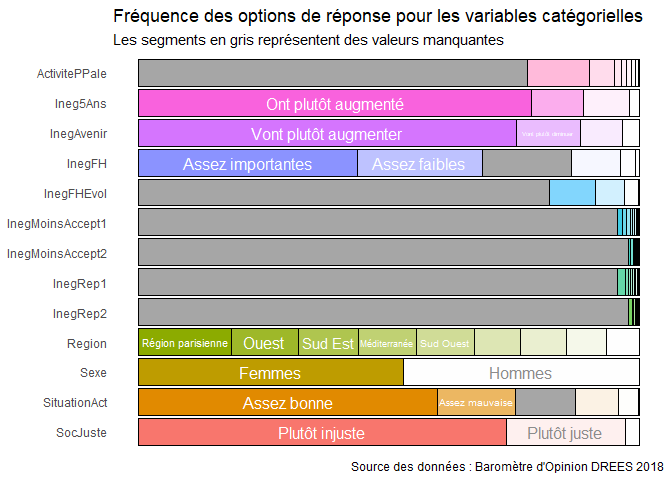<!-- -->

Les valeurs manquantes dans le graphique ci-contre peuvent s'expliquer par deux raisons :  

1) Certaines questions ne faisaient pas partie de l'enquête avant 2018 (i.e. Activité principale).  
2) L'échantillon de personnes enquêtées a été divisé en 4 sous-échantillons comparables (versions A, B, C et D) pour tester les effets des formulations sur les réponses des participant·e·s. (p.20 de la note méthodologique).  


```r
library(inspectdf)
# Inspecter les variables numériques
show_plot(inspect_num(BMT.JUST))+
  labs(title = "Fréquence des réponses pour les variables numériques (2000-2018)",
       subtitle = "",
       caption = "Source des données : Baromètre d'Opinion DREES 2018",
       y="")
```

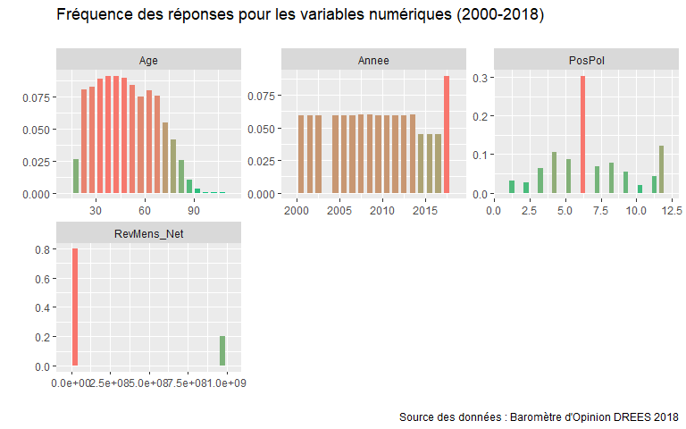


Les distributions indiquent que la plupart des répondant·e·s ont entre 25 ans et 70 ans environ. De plus, les personnes enquêtées sont davantage nombreuses en 2018 par rapport aux années précédentes.  


Étant donné l'absence de modalités pour lesquelles on attend des valeurs, le graphique des données manquantes pour les données numériques n'a, souvent, pas tant d'utilité. Toutefois, dans le cas des variables conservées, et plus précisément pour la variable "*Revenus nets mensuels au foyer*", on peut observer des valeurs *étranges* puisque 20% des personnes semblent avoir un revenu extrêmement supérieur par rapport aux autres.

Si l'on souhaite avoir plus de précisions, on peut mobiliser la fonction summary() :


```r
summary(BMT.JUST$Age)
```

```
##    Min. 1st Qu.  Median    Mean 3rd Qu.    Max. 
##   18.00   33.00   47.00   47.83   62.00  109.00
```

Concernant l'âge, on obtient les informations suivantes :  
- la personne enquêtée la plus jeune a 18 ans  
- la plupart des personnes ont 47 ans, la moyenne d'âge est 47.83  
- la personne la plus âgée a 109 ans  

<br>

On peut procéder de la même manière pour le revenu :  


```r
summary(BMT.JUST$RevMens_Net)
```

```
##      Min.   1st Qu.    Median      Mean   3rd Qu.      Max.      NA's 
##       100      1500      2500 203147932      5000 999999999     44155
```

<br>  

... Et on obtient :  

- Le revenu le plus bas est de 100 euros  
- La plupart des personnes déclarent un revenu de 2500 euros nets au foyer  
- La moyenne se situe à 203.147.932 euros  
- Le revenu le plus élevé est de 999999999 euros  

En toute évidence, certaines valeurs ne sont pas cohérentes avec l'ensemble des données. Dans ce cas, les données extrêmes peuvent être le résultat d'une stratégie de codage (i.e. marquer "999999999" lorsque la personne n'a pas répondu), par des erreurs de saisie de la part des participants ou au moment d'élaborer la base de données.

Puisque la moyenne est un paramètre statistique sensible aux valeurs extrêmes, les revenus les plus élevées ont une influence sur celle-ci. Dans ce cas, plusieurs alternatives s'offrent à l'analyste :  

- enlever les valeurs extrêmes et les valeurs manquantes
- créer une nouvelle catégorie avec ces valeurs  
- continuer l'analyse en gardant à l'esprit cette distribution  

Parmi ces options, il convient à l'analyste de décider celle qui lui convient le mieux dans le cadre de son travail. Parfois, les valeurs extrêmes ne sont pas le résultat d'erreurs de saisie et il convient de les traiter d'une manière précise.  

<style>
div.blue { background-color:#D8D8D8; border-radius: 5px; padding: 20px;}
</style>
<div class = "blue">

**NOTE :** Ici, nous décidons de garder les observations avec des valeurs extrêmes dans cette variable. Nous ne les enlèverons que lorsque nous allons traiter cette variable par la suite.

</div>

<br>
<br>

Puisque notre analyse se focalise sur l'année 2018, nous procédons à créer un nouvel objet contenant les données uniquement pour cette année :


```r
# Filtrer pour avoir uniquement les valeurs pour l'année 2018
BMT.JUST_2018 <- BMT.JUST_2018 <- BMT.JUST[BMT.JUST$Annee == 2018, ]
```

En mettant en place ce filtre, nous passons de 67296 à 3037 observations.

<br>


À titre illustratif, nous pouvons **réexaminer les variables** :  

```r
library(inspectdf)
# Inspecter les variables catégorielles pour 2018
show_plot(inspect_cat(BMT.JUST_2018))+
  labs(title = "Fréquence des options de réponse pour les variables catégorielles (2018)",
       subtitle = "Les segments en gris représentent des valeurs manquantes",
       caption = "Source des données : Baromètre d'Opinion DREES 2018")
```

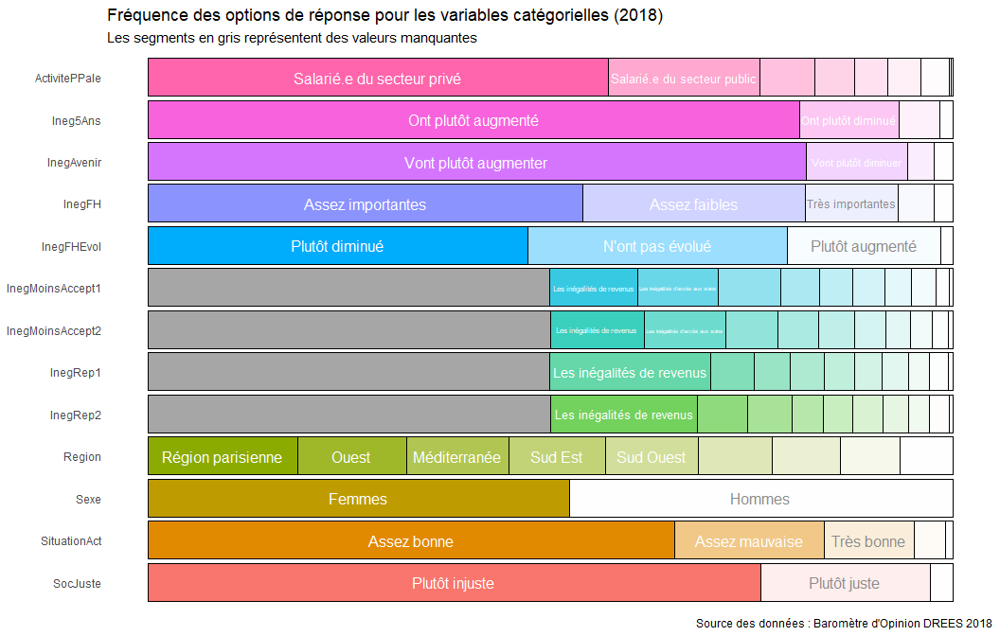<!-- -->

Lorsque nous inspectons les variables catégorielles pour cette année, nous observons moins de valeurs manquantes dans chacune des variables par rapport au jeu de données complet. Par ailleurs, les 4 questions qui contiennent des valeurs manquantes illustrent les différentes versions du questionnaire.

<style>
div.green { background-color:#ace600; border-radius: 5px; padding: 20px;}
</style>
<div class = "green">

**NOTE :** En interne, la fonction showplot() fait appel à la fonction ggplot2 pour l'élaboration de graphiques. De fait, nous pouvons rajouter des éléments en intégrant la même grammaire de ggplot. Pour plus d'informations concernant cette grammaire, vous pouvez vous référer au cours [Graphiques](http://egallic.fr/Enseignement/R/Slides/graphiques.pdf) de Ewen Gallic, maître de conférences à l'Université d'Aix-Marseille.

</div>

<br>
<br>

### Explorer une variable numérique : Âge des répondant·e·s


```r
library(tidyverse)
ggplot(BMT.JUST_2018, aes(x= Age))+
  geom_histogram(bins = 10) + # l'option "bins" permet de choisir le nombre d'observations par catégorie (ici 1 année = 1 catégorie)
  labs(title = "Nombre de personnes selon l'âge",
       subtitle = "Année de référence : 2018",
       y= "Nombre de personnes",
       caption = "Source des données : Baromètre d'Opinion DREES 2018")
```

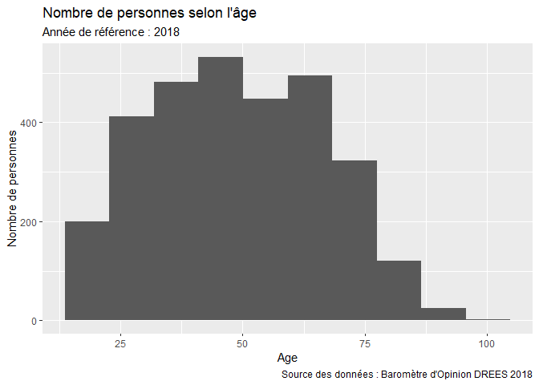<!-- -->

<br>

En précisant que l'on souhaite regrouper les observations en 10 *bacs* (bins = 10), on pourrait penser que les données suivent une distribution *normale* où la plupart des répondant·e·s ont environ 50 ans. On peut explorer exactement cette valeur :


```r
summary(BMT.JUST_2018$Age)
```

```
##    Min. 1st Qu.  Median    Mean 3rd Qu.    Max. 
##   18.00   34.00   49.00   49.02   63.00  100.00
```

Le tableau obtenu à l'aide de la fonction summary() montre que la moyenne et la médiane sont presque les mêmes (49 et 49.02 respectivement). 

Cependant, la distribution des données pour l'âge n'est [normale](https://fr.wikipedia.org/wiki/Loi_normale) qu'en précisant un nombre réduit de *bacs*. En effet, lorsque l'on augmente le nombre des *bacs* regroupant les observations, on observe que la distribution ne suit pas une loi normale :


```r
library(tidyverse)
ggplot(BMT.JUST_2018, aes(x= Age))+
  geom_histogram(bins = 90)+
  theme_minimal()+
  labs(title = "Nombre de personnes selon l'âge",
       subtitle = "Année de référence : 2018",
       y= "Nombre de personnes",
       caption = "Source des données : Baromètre d'Opinion DREES 2018")
```

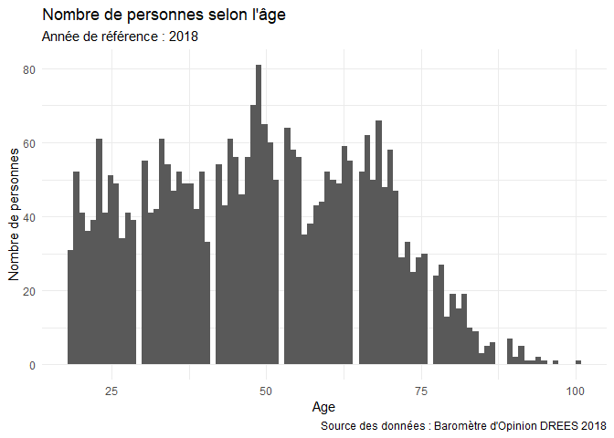<!-- -->

<br>
<br>
<br>
<br>  

### Explorer une variable catégorielle : La société française aujourd'hui, vous paraît-elle plutôt juste ou plutôt injuste ?  


```r
library(tidyverse)
ggplot(data= BMT.JUST_2018, aes(x = fct_rev(fct_infreq(SocJuste)))) +
  geom_bar(aes(y = (..count..)), fill = c("peachpuff4", "steelblue3", "tomato")) +
  geom_text(stat='count', aes(label=paste(..count.., "personnes"), vjust=-1, hjust= -.2))+
  coord_flip(ylim = c(0, 3000))+
  theme_bw()+
  labs(title = "La société française aujourd'hui, vous paraît-elle plutôt juste ou plutôt injuste ?",
       subtitle = "Année de référence : 2018 ",
       x= "",
       y= "",
       caption = "Source des données : Baromètre d'Opinion DREES 2018")+
  theme(legend.position = "none")
```

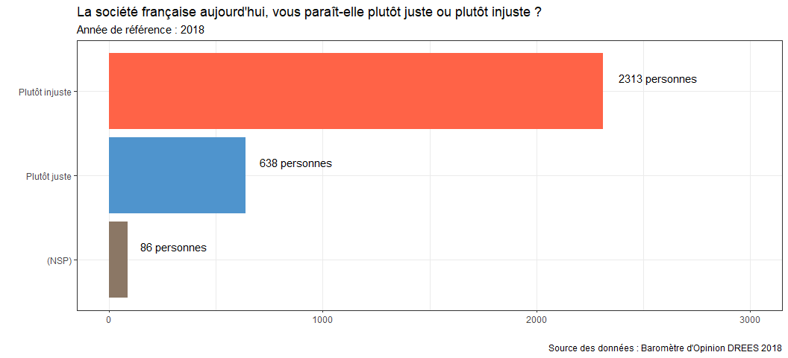<!-- -->


Avec ce graphique, on observe que la plupart des enquêté·e·s (n= 2313) déclarent que la société française leur semble aujourd'hui *plutôt injuste*. Ensuite, 638 personnes déclarent que la société française leur semble être *plutôt juste* et 86 personnes ne savent pas ou ne répondent pas. 

Ce résultat peut également être appréhendé en termes de pourcentages :


```r
library(tidyverse)
ggplot(data= BMT.JUST_2018, aes(x = fct_rev(fct_infreq(SocJuste)))) +
  geom_bar(aes(y = (..count..)/sum(..count..)), fill = c("peachpuff4", "steelblue3", "tomato")) +
  geom_text(aes(y = ((..count..)/sum(..count..)), label = scales::percent((..count..)/sum(..count..))), stat = "count", hjust = -.2)+
  scale_y_continuous(labels = scales::percent)+
  coord_flip(ylim = c(0, 1))+
  theme_minimal()+
  theme_bw()+
  labs(title = "La société française aujourd'hui, vous paraît-elle plutôt juste ou plutôt injuste ?",
       subtitle = "Année de référence : 2018",
       x= "",
       y= "Fréquence relative",
       caption = "Source des données : Baromètre d'Opinion DREES 2018")+
  theme(legend.position = "none")
```

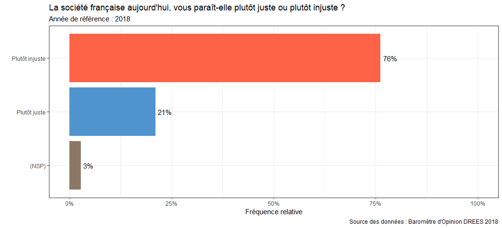<!-- -->

<br>
<br>


<style>
div.green { background-color:#ace600; border-radius: 5px; padding: 20px;}
</style>
<div class = "green">

Pour plus d’informations sur l'ajout d'étiquettes sur ce type de graphiques, voir :

https://stackoverflow.com/questions/26553526/how-to-add-frequency-count-labels-to-the-bars-in-a-bar-graph-using-ggplot2

</div>  

<br>
<br>


### Explorer une variable catégorielle (bis) : Passé et avenir des inégalités en France...  

Dans cette partie nous utilisons la librairie *ggchart* pour illustrer le type de graphique lollipop.

Étant donné le caractère récent de cette librairie et qu'elle se trouve couramment en développement, elle n'est pas encore disponible sur CRAN. Dès lors, on peut la télécharger directement de GitHub :


```r
# ggcharts
remotes::install_github("thomas-neitmann/ggcharts")
```

<br>

Avant d'utiliser cette fonction, les données doivent être agencées dans un format spécifique. Pour cela, on procède à la création d'un tableau contenant uniquement les réponses et les fréquences correspondant à la question : "Globalement, depuis 5 ans, diriez-vous que les inégalités en France."


```r
# Préparation des données  
InegDep5Ans <- BMT.JUST_2018 %>% 
  group_by(Ineg5Ans) %>% 
  summarize(NbDePersonnes = count(Ineg5Ans)) %>% 
  pull()
```


```r
# Graphique  
library(ggcharts)
ggcharts::lollipop_chart(InegDep5Ans, x= x, y= freq) +
                         labs(title= "Globalement, depuis 5 ans, diriez-vous que les inégalités en France...",
                              x= "Modalité de réponse",
                              y= "Nombre de personnes",
                              caption = "Source des données : Baromètre d'Opinion DREES 2018")
```

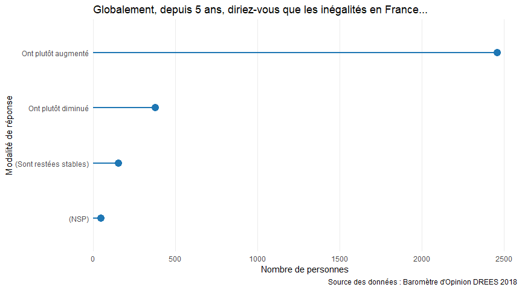<!-- -->
<br>

La plupart des personnes enquêtées (n= 2458) considèrent que les inégalités ont plutôt augmenté, suivies par 377 personnes qui considèrent qu'elles ont plutôt diminué, 154 pour lesquelles elles sont restées stables et 48 personnes qui ne savent pas.

<br>

On peut procéder de la même sorte **pour la question concernant les inégalités à l'avenir** :


```r
InegDepAvenir <- BMT.JUST_2018 %>% 
  group_by(InegAvenir) %>% 
  summarize(NbDePersonnes = count(InegAvenir)) %>% 
  pull()

library(ggcharts)
ggcharts::lollipop_chart(InegDepAvenir, x= x, y= freq) +
  labs(title = "À l'avenir, pensez-vous que les inégalités en France...",
       x= "Modalité de réponse",
       y= "Nombre de personnes",
       caption = "Source des données : Baromètre d'Opinion DREES 2018")
```

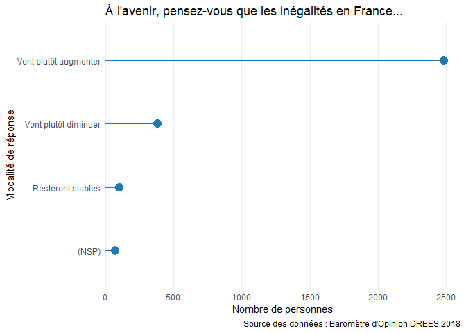<!-- -->

<br>

Concernant les inégalités à l'avenir, 2484 personnes considèrent qu'elles vont plutôt augmenter, 384 qu'elles vont plutôt diminuer, 100 qu'elles resteront stables et 69 personnes qui ne savent pas ou ne savent pas.  
 

<br>
<br>

### Une variable numérique et une variable catégorielle : Inégalités sur 10 ans et nombre de répondant·e·s  

La fonction ggcharts permet convenablement de représenter les résultats en accentuant les résultats d'une modalité de réponse. Ici on peut observer les réponses pour la question sur les inégalités entre les hommes et les femmes avec une perspective sur les 10 dernières années :  


```r
InegFHAvenir <- BMT.JUST_2018 %>% 
  group_by(InegFHEvol) %>%
  summarize(NbDePersonnes = count(InegFHEvol)) %>% 
  pull()

ggcharts::bar_chart(InegFHAvenir, x,
          InegFHAvenir$freq,
          highlight = "N'ont pas évolué")+
  labs(title = "Depuis 10 ans, diriez-vous que les inégalités entre les
hommes et les femmes ont plutôt augmenté ou plutôt diminué en France ?",
       x= "Modalité de réponse",
       y= "Nombre de personnes",
       caption="Source des données : Baromètre d'Opinion DREES 2018")
```

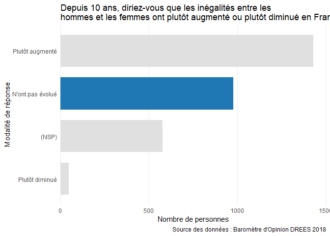<!-- -->

<br>

La plupart des personnes enquêtées (n=1433) déclare que depuis 10 ans, les inégalités entre les hommes et les femmes ont plutôt diminué, contre 980 personnes qui déclarent que les mêmes inégalités n'ont pas évolué.

### Deux variables catégorielles : Sexe de l'enquêté·e et perception des inégalités entre les femmes et les hommes

Avant de s'attarder sur la présentation graphique, il convient d'extraire les pourcentages correspondant à la relation entre les deux variables. Pour ce faire, une option consiste à créer un tableau contenant les informations qui nous intéressent. La procédure peut s'écrire sur une même ligne de code en suivant 4 étapes :

1) Regroupement des données par sexe à l'aide de la fonction group_by() du package dplyr  
2) Comptage du nombre d'observations selon chaque modalité de la variable InegFH (Inégalités entre les femmes et les hommes) à l'aide de la fonction count() également proposée par le package dplyr.  
3) Création de deux nouvelles colonnes contenant les pourcentages des observations et les labels des pourcentages à mettre dans le graphique par la suite.  
4) Construction du graphique  


```r
BMT.JUST_2018 %>%
  #Regroupement des données par sexe
  group_by(Sexe) %>%
  # Comptage du nombre d'observations selon chaque modalité de la variable InegFH (Inégalités entre les femmes et les hommes)
  dplyr::count(InegFH) %>%
  # Création de deux nouvelles colonnes (Pourcentages et pct_label) contenant les pourcentages des observations et les labels des pourcentages à mettre dans le graphique par la suite.
  mutate(Pourcentages = n / sum(n),
         pct_label = scales::percent(Pourcentages, accuracy = .1)) %>%
  # Graphique
  ggplot(aes(x= Sexe, fill = InegFH, y = Pourcentages)) +
  geom_col() +
  theme_minimal() +
  geom_text(aes(label = pct_label), position = position_stack(vjust = 0.5), size = 3) +
  scale_y_continuous(labels = scales::percent)+
  labs(title ="Avez-vous le sentiment que les inégalités entre les hommes et 
les femmes en France sont aujourd'hui...",
       subtitle = "Réponses selon le sexe et la modalité de réponse",
       x = "",
       y= "Fréquences relatives",
       caption = "Source des données : Baromètre d'Opinion DREES 2018",
       fill = "")
```

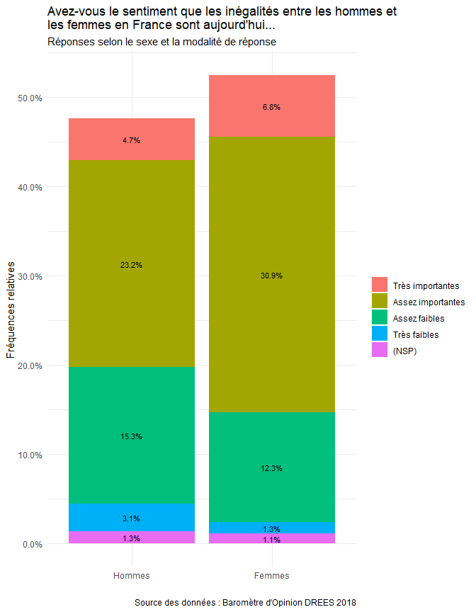<!-- -->

Femmes et hommes ont pour la plupart (30,9 et 23.2% respectivement) le sentiment que les inégalités entre les femmes et les hommes en France sont aujourd'hui *assez importantes*. Toutefois, la part des femmes qui pensent que les inégalités sont très importantes et assez importantes est supérieure à celle des hommes. Plus loin, nous analysons si cette différence est statistiquement significative et représentative de la population totale.  


Dans le graphique précédent, les résultats comprennent l'ensemble des données. Afin d'avoir une perspective dite *intra-groupe* nous pouvons procéder d'une manière différente :  


```r
ggplot(BMT.JUST_2018, aes(x= fct_infreq(InegFH),  group=Sexe)) + 
  geom_bar(aes(y = ..prop.., fill = factor(..x..)), stat="count") +
  geom_text(aes( label = scales::percent(..prop..),
                 y= ..prop.. ), stat= "count", vjust = -.5)+
  facet_grid(~Sexe) +
  scale_y_continuous(labels = scales::percent)+
  expand_limits(y=c(0, .70))+
  theme(axis.text.x = element_text(angle = 45, hjust = 1),
        legend.position = "none") +
  labs(title= "Avez-vous le sentiment que les inégalités entre 
les hommes et les femmes en France sont aujourd'hui...",
  subtitle= "Réponses selon le genre et la modalité de réponse", 
       y= "Fréquences relatives",
x= "",
       caption = "Source des données : Baromètre d'Opinion DREES 2018")
```

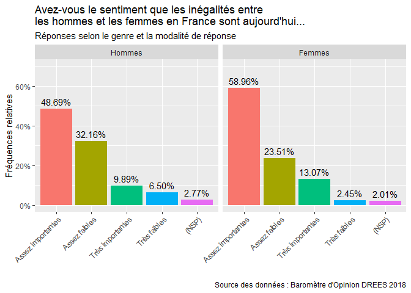<!-- -->


<style>
div.green { background-color:#ace600; border-radius: 5px; padding: 20px;}
</style>
<div class = "green">

**NOTE:** Le code pour ce graphique s'inspire des codes disponibles dans le ["Repo" de Sebastien Sauer](https://sebastiansauer.github.io/percentage_plot_ggplot2_V2/)


</div>

<br>


### Une variable numérique et une variable catégorielle : Âge et justice de la société française  

**Âge des participant·e·s et avis sur la justice de la société française**


```r
ggplot(BMT.JUST_2018, aes(x= SocJuste, y= Age))+
  geom_jitter(alpha= .05, width = .2)+
  geom_point(aes(col = SocJuste), show.legend = FALSE) +
  geom_boxplot(width=0.1)+
  theme_minimal()+
  theme(axis.title.x = element_blank())+
  scale_color_manual(values=c("steelblue3", "tomato", "peachpuff4"))+
  geom_hline(yintercept=50, linetype="dashed", color = "tomato")+
  geom_text(x=3.8, y=60, label="Plus de 50 ans", color = "tomato", alpha=0.6)+
  geom_text(x=3.8, y=40, label="Moins de 50 ans", color = "tomato", alpha=0.6)+
  annotate("segment", x = 3.8, xend = 3.8, y = 50, yend = 42, colour = "tomato", size=1, alpha=0.6, arrow=arrow())+
  annotate("segment", x = 3.8, xend = 3.8, y = 50, yend = 58, colour = "tomato", size=1, alpha=0.6, arrow=arrow())+
  expand_limits(x=c(0,5))+
  labs(title= "La société française aujourd'hui, vous paraît-elle plutôt juste ou plutôt injuste ?",
       subtitle = "Réponses selon l'âge et la modalité de réponse",
       caption = "Source des données : Baromètre d'Opinion DREES 2018")
```

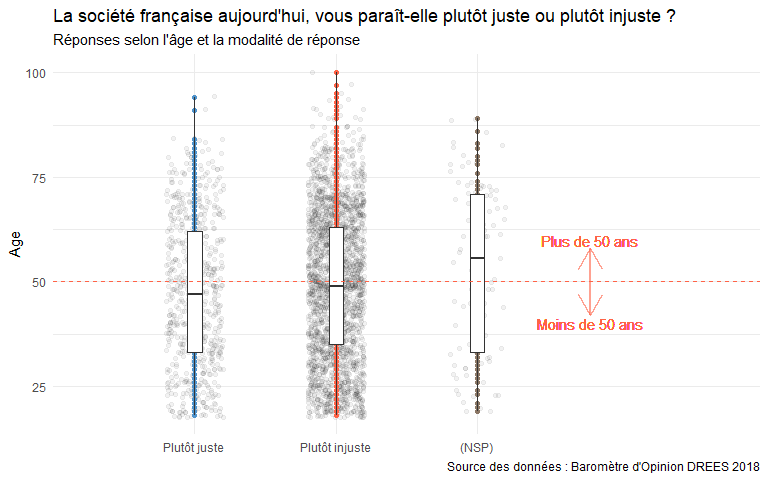<!-- -->

Le boxplot ci-contre, connu également comme graphique [boîte-à-moustache](https://www.stat4decision.com/fr/le-box-plot-ou-la-fameuse-boite-a-moustache/) fourni des informations telles que la médiane (trait à l'intérieur des boîtes) et les quartiles (extrêmes des boîtes). Ont été rajoutées les observations ou individus (points noirs) afin de mettre en lumière les différentes densités dans chacun des choix de réponse. Ici, on observe donc une densité davantage importante pour l'option de réponse "Plutôt injuste".

<br>

<style>
div.green { background-color:#ace600; border-radius: 5px; padding: 20px;}
</style>
<div class = "green">

Pour plus d'informations concernant l'ajout d'informations sur le graphique voir :

- [Line segments and curves](https://ggplot2.tidyverse.org/reference/geom_segment.html#examples)  
- [ggplot2 textes : Ajouter du texte à un graphique - Logiciel R et visualisation de données](www.sthda.com/french/wiki/ggplot2-textes-ajouter-du-texte-a-un-graphique-logiciel-r-et-visualisation-de-donnees)  

</div>  
  
<br>

### Autres variables  
#### Activité principale des enquêté·e·s, genre et justice de la société française    


```r
# Les fonctions fct_infreq() et fct_rev() permettent d'organiser les bares des graphiques selon leur fréquence
ggplot(BMT.JUST_2018, aes(x = fct_rev(fct_infreq(ActivitePPale)), fill = SocJuste)) +
  geom_bar() +
# Avec ggplot, il est possible de choisir les couleurs manuellement ou à l'aide de "palettes". Ici on utilise la palette "Paired"
  scale_fill_brewer(palette = "Paired") +
  coord_flip() +
  theme_bw() +
  facet_grid(Sexe~.) +
  labs(title= "La société française aujourd'hui, vous paraît-elle plutôt juste ou plutôt injuste ?",
       subtitle = "Réponses selon le genre et l'activité principale déclarée",
       caption = "Source des données : Baromètre d'Opinion DREES 2018",
       x= "Activité principale des personnes enquêtées",
       y= "Nombre de personnes")
```

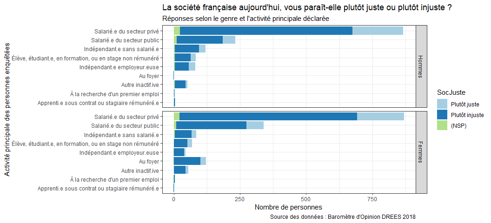<!-- -->

Le graphique ci-contre met en évidence que, parmi les enquêté·e·s, la perception de justice de la société française varie peu selon le genre et l'activité principale exercée. L'ensemble des personnes considère que la société française est aujourd'hui plutôt injuste.

<br>

<style>
div.green { background-color:#ace600; border-radius: 5px; padding: 20px;}
</style>
<div class = "green">

Avec ggplot, il est possible de choisir les couleurs manuellement ou à l'aide de "palettes". Pour plus d'informations voir: https://fost-project.netlify.com/rresources/dataviz/


</div>

<br>

#### Situation actuelle des enquêté·e·s, genre et perception d'une société juste


```r
ggplot(BMT.JUST_2018, aes(x = fct_infreq(SituationAct), fill = SocJuste)) +
  geom_bar(position = "dodge") +
  scale_fill_brewer(palette = "Paired") +
  theme_bw() +
  theme(axis.text.x = element_text(angle = 45, hjust = 1))+
  facet_wrap(~Sexe)+
  labs(title= "La société française aujourd'hui, vous paraît-elle plutôt juste ou plutôt injuste ?",
       subtitle = "Réponses selon le genre et la situation déclarée au moment de l'enquête",
       x = "Situation déclarée au moment de l'enquête",
       y = "Nombre de personnes")
```

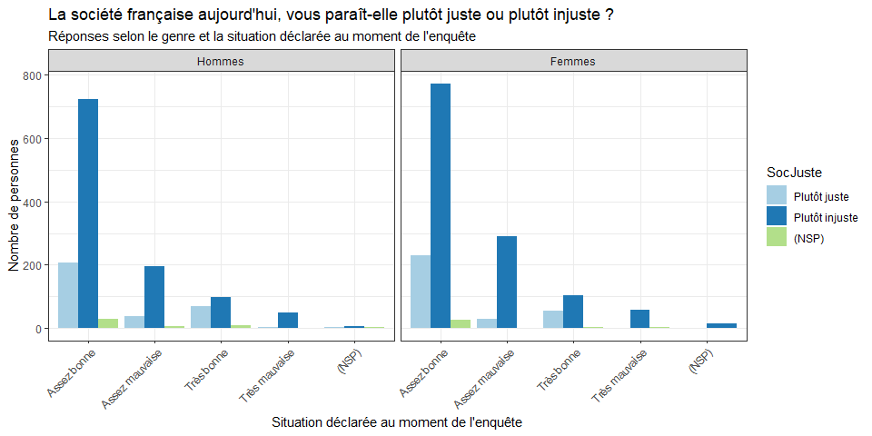<!-- -->

Le graphique ci-contre met en évidence que la perception de la société française en tant que société plutôt juste ou injuste est constante selon le genre et la situation déclarée **au moment de l'enquête**. 

Toutefois, la "situation actuelle" peut s'avérer être une notion hautement polysémique. En d'autres mots, avoir une bonne situation n'est pas la même chose pour tout le monde.

Si l'on souhaite appréhender la "situation actuelle" au moyen d'une "situation financière", par exemple, on peut utiliser la variable de revenus nets mensuels au foyer.  


<style>
div.blue { background-color:#D8D8D8; border-radius: 5px; padding: 20px;}
</style>
<div class = "blue">

**NOTE :** Réduire la situation actuelle au seul critère des revenus revient à négliger toute une série d'indicateurs tels que l'accès à la prestation de soins en santé ou des journées de travail n'entraînant pas des risques psychosociaux. Nous utilisons ce critère à titre illustratif.  

</div>  

<br>

#### Revenus nets mensuels au foyer, genre et perception d'une société juste


```r
BMT.JUST_2018 %>%
  filter(RevMens_Net <= 100000000L) %>%
  ggplot(aes(x = Sexe, y = RevMens_Net, fill = SocJuste)) +
  geom_boxplot() +
  scale_y_continuous(trans = "log")+
  scale_fill_manual(values=c("steelblue3", "tomato", "peachpuff4"))+
  theme_bw()+
  labs(title= "La société française aujourd'hui, vous paraît-elle plutôt juste ou plutôt injuste ?",
      subtitle= "Réponses selon le genre et le revenu mensuel net au foyer",
      x = " ", 
      y = "Revenus mensuels nets au foyer")
```

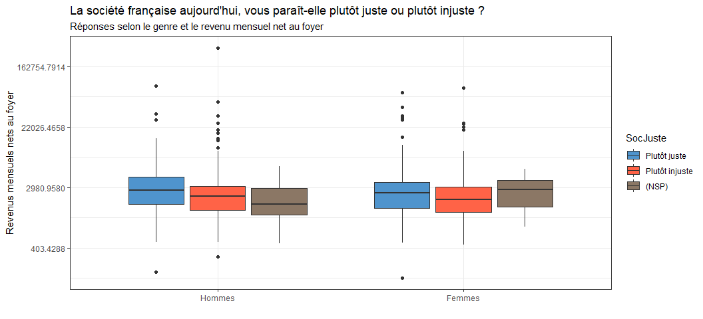<!-- -->

Ce graphique met en évidence le fait que le revenu net mensuel au foyer a une influence sur le type de réponse concernant la perception de la justice dans la société française. En effet, plus le revenu net mensuel au foyer est important, plus une personne aura tendance à évaluer la société française comme étant plutôt juste. Par ailleurs, cet effet semble être davantage important chez les hommes que chez les femmes.
<br>


#### Inégalités les plus répandues et inégalités les moins acceptables  

Comme nous l'avons vu au début de la partie "Variables et valeurs manquantes", l'échantillon de personnes enquêtées a été divisé en 4 sous-échantillons comparables. Puisque les variables que nous analysons dans cette sous-partie ont fait l'objet de telle procédure, il convient de les traiter séparément :

**Filtrage des valeurs manquantes dans l'une et l'autre des versions :**


```r
# Groupe 1
BMT.JUST_G1 <- BMT.JUST_2018 %>%
  drop_na(InegRep1, InegMoinsAccept1)

# Groupe 2
BMT.JUST_G2 <- BMT.JUST_2018 %>%
  drop_na(InegRep2, InegMoinsAccept2)
```

Chacun des jeux de données contient désormais 1520 et 1517 observations respectivement.

Maintenant, on peut procéder à la construction du graphique. Dans ce cas, on sauvegarde chacun des graphiques dans un objet afin de présenter les 2 graphiques dans un même objet à l'aide des libraries [grid](https://www.rdocumentation.org/packages/grid/versions/3.6.2) et [gridExtra](https://cran.r-project.org/web/packages/gridExtra/index.html)


```r
# Premier groupe
Ineg1 <- ggplot(BMT.JUST_G1, aes(x = fct_rev(fct_infreq(InegMoinsAccept1)), fill = SocJuste)) + 
  geom_bar(position = "dodge") +
  scale_fill_brewer(palette = "Paired") +
  coord_flip() +
  theme_bw() +
  facet_wrap(~Sexe)+
  labs(title= "Groupe 1",
       x = "Inégalité la moins acceptable",
       y = "Nombre de personnes")

# Deuxième groupe
Ineg2 <- ggplot(BMT.JUST_G2, aes(x = fct_rev(fct_infreq(InegMoinsAccept2)), fill = SocJuste)) + 
  geom_bar(position = "dodge") +
  scale_fill_brewer(palette = "Paired") +
  coord_flip() +
  theme_bw() +
  facet_wrap(~Sexe)+
  labs(title= "Groupe 2",
       x = "Inégalité la moins acceptable",
       y = "Nombre de personnes")
```


```r
library(gridExtra)
library(grid)
# Les deux graphiques en un seul plan
grid.arrange(
  Ineg1, Ineg2,
  nrow = 2,
  top= textGrob("     Quel type d'inégalité vous semble la moins acceptable aujourd'hui ?
                      Réponses selon le genre et la modalité de réponse", 
                gp= gpar(fontsize=14)),
  bottom = textGrob("Source des données : Baromètre d'Opinion DREES 2018",
                    gp = gpar(fontface = 3, fontsize = 9, fontface='bold'),
                    hjust = 1,
                    x = 1)
  )
```

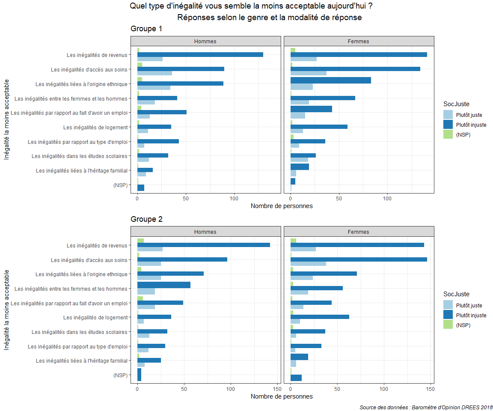


<style>

div.green { background-color:#ace600; border-radius: 5px; padding: 20px;}
</style>
<div class = "green">

Une alternative à la présentation de graphiques "côte à côte" consiste à faire appel à la configuration de Markdown avant d'être exporté en format html. Veuillez noter que cette alternative ne crée pas une image comme nous venons de le faire dans cet exemple.

Pour plus d'informations, vous pouvez consulter:  

- [flexdashboard: Easy interactive dashboards for R](https://rmarkdown.rstudio.com/flexdashboard/)  

</div>  

<br>


Il est tout à fait possible d'avoir une représentation différente des données, par exemple à l'aide d'un graphique "pyramide". Pour cela, on reprend sensiblement la même méthode qu'avec les graphiques précédents.

**Comptage des observations dans chacune des modalités selon le groupe**


```r
BMT.JUST_G1Comptes <- BMT.JUST_G1 %>%
  summarize(Choix = count(InegRep1))%>%
  pull()%>%
  arrange(desc(freq))
  
  
BMT.JUST_G2Comptes <- BMT.JUST_G2 %>%
  summarize(Choix = count(InegRep2))%>%
  pull()%>%
  arrange(desc(freq))
```


```r
library(plotrix)
pyramid.plot(
  # Valeurs pour le premier groupe
  BMT.JUST_G1Comptes$freq, 
  # Valeurs pour le deuxième groupe
  BMT.JUST_G2Comptes$freq,
  # Modalités
  labels = BMT.JUST_G2Comptes$x, 
  top.labels = c("Groupe 1", "Modalité", "Groupe 2"), 
  main = "Quel type d'inégalité vous semble la moins acceptable aujourd'hui ?",
  unit = "",
  ndig = 0,
  gap = 599,
  show.values = T,
  lxcol = "tomato",
  rxcol = "#00AFBB"
)
```

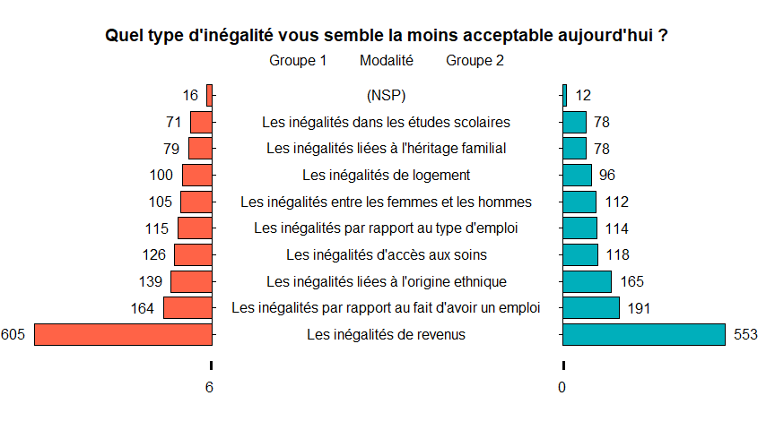<!-- -->

```
## [1] 5.1 4.1 4.1 2.1
```


Malgré la simplicité offerte par la fonction *pyramid.plot()* de la librairie *plotrix* pour l'élaboration de ce type de graphique, cette méthode ne permet de représenter que deux variables en même temps. De plus, l'élaboration du graphique est peu flexible. Pour contourner cela, on peut faire appel à une méthode alternative en combinant ggplot et plotrix.  

<style>

div.green { background-color:#ace600; border-radius: 5px; padding: 20px;}
</style>
<div class = "green">

Le code suivant est repris et adapté de : [Pyramid plot in R](https://stackoverflow.com/questions/33832047/pyramid-plot-in-r)

</div>


```r
# librairies
library(plyr)
library(ggplot2)
library(scales)
library(gtable)
library(stringr)
library(grid)

  
# Thème commun pour les graphiques
theme = theme(panel.grid.minor = element_blank(),
         panel.grid.major = element_blank(),
         axis.text.y = element_blank(), 
         axis.title.y = element_blank(),
         plot.title = element_text(size = 10, hjust = 0.5))

# Créer un nouvel objet avec les valeurs correspondant uniquement aux hommes
BMT.JUST_G1.M <- BMT.JUST_G1 %>%
  filter(Sexe == "Hommes")

#### Graphique des hommes (à apparaître du côté droit)
ggM <- ggplot(BMT.JUST_G1.M, aes(x=fct_rev(fct_infreq(Region)), fill = InegRep1)) +
   geom_bar() +
   labs(x = "Nombre de personnes") +
  scale_fill_brewer(palette = "Paired") +
   ggtitle("Hommes") +
   coord_flip() + theme +
   theme(plot.margin= unit(c(1, 0, 0, 0), "lines"))

# extraire les données du graphique
gtM <- ggplotGrob(ggM)


#### Extraire la légende
leg = gtM$grobs[[which(gtM$layout$name == "guide-box")]]


#### 1. back to "male" plot - to appear on the right
# remove legend
legPos = gtM$layout$l[grepl("guide", gtM$layout$name)]  # Position de la légende
gtM = gtM[, -c(legPos-1,legPos)]

BMT.JUST_G1.F <- BMT.JUST_G1 %>%
  filter(Sexe == "Femmes")

#### Créer un nouvel objet avec les valeurs correspondant uniquement aux femmes - à apparaître à gauche - 
# Les axes et les valeurs sont inversés
ggF <- ggplot(BMT.JUST_G1.F, aes(x=fct_rev(fct_infreq(Region)), fill = InegRep1)) +
   geom_bar() +
   scale_y_continuous(trans = 'reverse') + 
   labs(x = "Nombre de personnes") +
   scale_fill_brewer(palette = "Paired") +
   ggtitle("Femmes") +
   coord_flip() + theme +
   theme(plot.margin= unit(c(1, 0, 0, 1), "lines"))

# extraire les données du graphique
gtF <- ggplotGrob(ggF)

# Enlever la légende
gtF = gtF[, -c(legPos-1,legPos)]


## Échanger les graduations sur le côté droit du panneau de tracé
# Récupérer le numéro de ligne de l'axe gauche dans la mise en page
rn <- which(gtF$layout$name == "axis-l")

# Extraire l'axe (graduations et texte de l'axe)
axis.grob <- gtF$grobs[[rn]]
axisl <- axis.grob$children[[2]]
# axisl  # Note: deux grobs - texte et graduations

# Obtenir les graduations - REMARQUE: les graduations sont les secondes
yaxis = axisl$grobs[[2]] 
yaxis$x = yaxis$x - unit(1, "npc") + unit(2.75, "pt") # Inversez-les

# Ajoutez-les sur le côté droit du panneau
# Ajouter une colonne à la gtable
panelPos = gtF$layout[grepl("panel", gtF$layout$name), c('t','l')]
gtF <- gtable_add_cols(gtF, gtF$widths[3], panelPos$l)
# Ajouter le grob
gtF <-  gtable_add_grob(gtF, yaxis, t = panelPos$t, l = panelPos$l+1)

# Supprimer l'axe gauche d'origine
gtF = gtF[, -c(2,3)]


#### 3. Étiquettes des régions - créer un tracé en utilisant geom_text - pour apparaître au milieu
fontsize = 3
ggC <- ggplot(BMT.JUST_G1, aes(x=fct_rev(fct_infreq(Region)))) +
   geom_bar(stat = "identity", aes(y = 0)) +
   geom_text(aes(y = 0,  label = Region), size = fontsize) +
   ggtitle("Région") +
   coord_flip() + theme_bw() + theme +
   theme(panel.border = element_rect(colour = NA))

# obtenir le grob
gtC <- ggplotGrob(ggC)

# obtenir le titre
Title = gtC$grobs[[which(gtC$layout$name == "title")]]

# Obtenez le panneau de tracé
gtC = gtC$grobs[[which(gtC$layout$name == "panel")]]


Region <- c("Région parisienne", "Ouest", "Méditerranée", "Sud Est", "Sud Ouest", "Bassin Parisien Ouest", "Est", "Bassin Parisien Est", "Nord")


#### Organiser les composants
## 1) Combiner les graphiques "femmes" et "hommes"
gt = cbind(gtF, gtM, size = "first")

## 2) Ajouter les étiquettes (gtC) au milieu
# ajouter une colonne à gtable
maxlab = Region[which(str_length(Region) == max(str_length(Region)))]
gt = gtable_add_cols(gt, sum(unit(1, "grobwidth", textGrob(maxlab, gp = gpar(fontsize = fontsize*72.27/25.4))), unit(5, "mm")), 
           pos = length(gtF$widths))


# ajouter le grob
gt = gtable_add_grob(gt, gtC, t = panelPos$t, l = length(gtF$widths) + 1)

# ajoutez le titre; c'est-à-dire le label «Région»
titlePos = gtF$layout$l[which(gtF$layout$name == "title")]
gt = gtable_add_grob(gt, Title, t = titlePos, l = length(gtF$widths) + 1)


## 3) Ajouter la légende à droite
gt = gtable_add_cols(gt, sum(leg$width), -1)
gt = gtable_add_grob(gt, leg, t = panelPos$t, l = length(gt$widths))

# dessiner le graphique
grid.newpage()
grid.draw(gt)
```

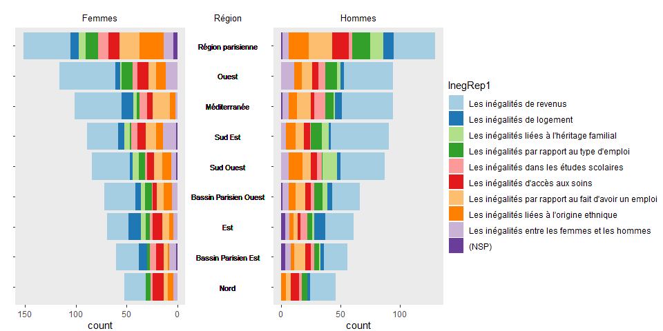<!-- -->

  <style>
div.orange { background-color:#ff8847; border-radius: 5px; padding: 20px;}
  </style>
  <div class = "orange">
**Le graphique ci-contre illustre le nombre de réponses pour chaque modalité de la question relative aux inégalités les plus répandues. Les données sont présentées par région et par genre mais concernent uniquement la version AB du questionnaire.**  

</div>

<br>

L'analyste pourra constater que cette méthode n'est pas une moindre affaire, mais elle colporte l'avantage de résumer un nombre important d'informations dans un format facilement lisible.  

Enfin, une autre manière de présenter les informations c'est à l'aide de la fonction facet_wrap(). Nous l'avons vu le long du document. Toutefois, le graphique suivant permet d'illustrer davantage son potentiel pour comparer des données :


```r
ggplot(BMT.JUST_G1, aes(x = Sexe, fill = InegRep1)) +
  geom_bar(position = "dodge") +
  scale_fill_brewer(palette = "Paired") +
  theme_bw() +
  facet_wrap(vars(Region))+
  theme(axis.title.x=element_blank())+
  labs(title= "Quel type d'inégalité vous semble la plus répandue aujourd'hui ?",
       subtitle = "Réponses selon le genre et la localisation géographique",
       x = "",
       y = "Nombre de personnes",
       caption = "
       
Source des données : Baromètre d'Opinion DREES 2018
Analyse correspondant à la modalité AB du questionnaire")
```

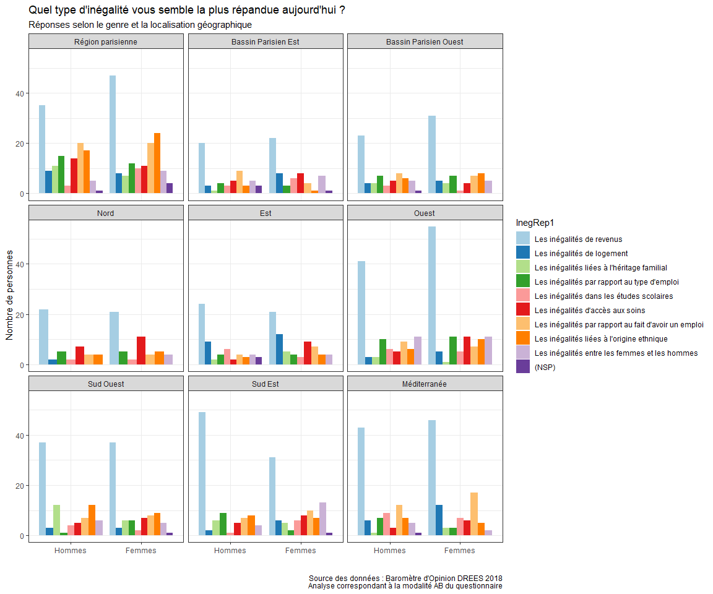

<br>

Ce graphique illustre convenablement le nombre de personnes par option de réponse, genre et localisation géographique. Nous pouvons constater que *les inégalités de revenus* est l'option de réponse la plus plébiscitée chez les femmes et les hommes dans toutes les régions. 

L'analyste peut également être interpellé·e par le fait que l'option de réponse *Inégalités d'accès aux soins* est davantage plébiscitée par les femmes que par les hommes dans toutes les zones géographiques définies, et ce, à l'exception de la région parisienne et le bassin Parisien Est.  

<br>
 

### Analyse Factorielle des Correspondances (AFC) : Positionnement politique et inégalités les moins acceptables

Avec les données dont nous disposons, il est tout à fait possible de réaliser une analyse factorielle des correspondances ou AFC. Ce type d'analyse offre la possibilité d'avoir une représentation graphique des relations entre les modalités de deux variables.  


<style>
div.blue { background-color:#D8D8D8; border-radius: 5px; padding: 20px;}
</style>
<div class = "blue">

"L'analyse factorielle des correspondances AFC développée par Jean-Paul Benzecri et ses collaborateurs emploie la métrique du chi-deux : chaque ligne est affectée d'une masse qui est sa somme marginale, le tableau étudié est le tableau des profils des lignes, ce qui sert à représenter dans le même espace à la fois les deux nuages de points associés aux lignes ainsi qu'aux colonnes du tableau de données ; elle est d'autre part particulièrement agréablement complétée par des outils de classification ascendante hiérarchique (CAH) qui permettent d'apporter des visions complémentaires, surtout en construisant des arbres de classification des lignes ou des colonnes." [Wikipedia](https://fr.wikipedia.org/wiki/Analyse_factorielle_des_correspondances)

</div>  
  


<style>
div.green { background-color:#ace600; border-radius: 5px; padding: 20px;}
</style>
<div class = "green">

**NOTE:** Cet exemple d'analyse factorielle des correspondances a été réalisée à l'aide de la publication ["Analyse factorielle des correspondances sous R - Partie I"](https://hal.archives-ouvertes.fr/hal-01516697/document) proposée par Jean-Baptiste Pressac et Laurent Mell 

</div>  


```r
# Enlever l'option de réponse "NSP" de la variable *inégalités les moins acceptables
SocJust <- droplevels(BMT.JUST_G1[!BMT.JUST_G1$InegMoinsAccept1 == "(NSP)",])

# Tableau de contingence
SocJustPosPolTab <- table(SocJust$InegMoinsAccept1, SocJust$PosPol)

# Analyse des correspondances
library(FactoMineR)
CA(SocJustPosPolTab)
```

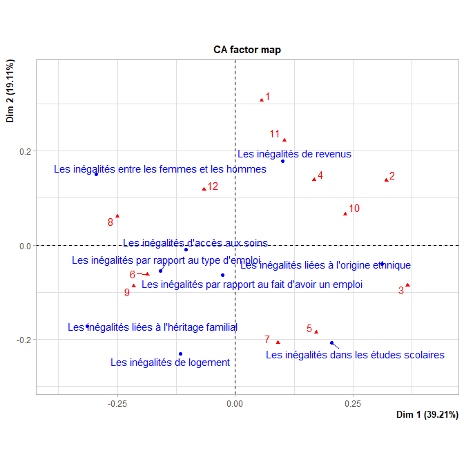<!-- -->

```
## **Results of the Correspondence Analysis (CA)**
## The row variable has  9  categories; the column variable has 12 categories
## The chi square of independence between the two variables is equal to 141.2875 (p-value =  0.0002727252 ).
## *The results are available in the following objects:
## 
##    name              description                   
## 1  "$eig"            "eigenvalues"                 
## 2  "$col"            "results for the columns"     
## 3  "$col$coord"      "coord. for the columns"      
## 4  "$col$cos2"       "cos2 for the columns"        
## 5  "$col$contrib"    "contributions of the columns"
## 6  "$row"            "results for the rows"        
## 7  "$row$coord"      "coord. for the rows"         
## 8  "$row$cos2"       "cos2 for the rows"           
## 9  "$row$contrib"    "contributions of the rows"   
## 10 "$call"           "summary called parameters"   
## 11 "$call$marge.col" "weights of the columns"      
## 12 "$call$marge.row" "weights of the rows"
```


Le graphique nous suggère que les personnes déclarant être au centre (5) et sensiblement à droite (7) tendent à répondre que les inégalités dans les études scolaires sont les moins acceptables. Une autre relation intéressante qui émerge est que ceux et celles déclarant être très à gauche (1) ou très à droite (11), tendent à répondre que les inégalités les moins acceptables sont les inégalités de revenus. Par ailleurs, les valeurs du test chi2 et les p-values suggèrent des différences très significatives, ce qui semble indiquer des liens très significatifs entre les lignes et les colonnes.  

Comme pour la visualisation de données avec ggplot2, l'AFC peut être visualisée de manières différentes :


```r
library(gplots)
```

```
## 
## Attaching package: 'gplots'
```

```
## The following object is masked from 'package:plotrix':
## 
##     plotCI
```

```
## The following object is masked from 'package:stats':
## 
##     lowess
```

```r
# 1. convertir les données en tant que table
dt <- as.table(as.matrix (SocJustPosPolTab))
# 2. Graphique
balloonplot(t(SocJustPosPolTab),
            main = "Inégalités les moins acceptables et 
positionnement politique (1= très à gauche; 11 = très à droite; 12= NSP)", xlab = "", ylab = "",
            label = FALSE, show.margins = FALSE)
```

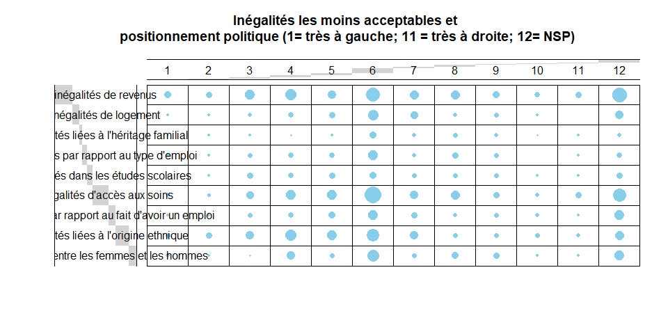<!-- -->

<br>

Dans ce cas, on peut remarquer des liens davantage forts entre les personnes déclarant un positionnement politique légèrement à droite et les inégalités de revenus, l'accès aux soins, l'origine ethnique et les inégalités entre les femmes et les hommes.  

<br>

<style>
div.green { background-color:#ace600; border-radius: 5px; padding: 20px;}
</style>
<div class = "green">
Pour plus d'informations concernant l'AFC, l'interprétation des valeurs proposées par la librairie FactoMiner et gplots ainsi que les méthodes associées, vous pouvez consulter :

[Méthodes des Composantes Principales dans R: Guide Pratique](http://www.sthda.com/french/articles/38-methodes-des-composantes-principales-dans-r-guide-pratique/83-afc-dans-r-avec-factominer-scripts-faciles-et-cours/)

Il est également possible de générer des rapports automatisés :

[Automatic Reports and Interpretation of Principal Component Analyses](http://www.sthda.com/english/articles/16-r-packages/28-factoinvestigate-r-package-automatic-reports-and-interpretation-of-principal-component-analyses)

</div>  
  

<br>

## Statistiques inférentielles  

La nuance entre statistiques descriptives et statistiques inférentielles peut initialement troubler certaines personnes. On peut dire que la statistique descriptive diffère de la statistique inférentielle par les **objectifs et les méthodes employées**. 

La première, la statistique descriptive, comme son nom l'indique, cherche à décrire des informations. La deuxième, en revanche, colporte un aspect probabiliste sur la population. Son objectif est d'étendre les résultats que l'on obtient à partir de tests tels que le Chi2 ou une régression, à un groupe de personnes plus large.  

<br>

<style>
div.green { background-color:#ace600; border-radius: 5px; padding: 20px;}
</style>
<div class = "green">

Pour plus d'informations à propos des nuances entre ces deux versants de la statistique, vous pouvez consulter:

- [Cours de statistiques par Laurence Reboul](http://iml.univ-mrs.fr/~reboul/cours1.pdf)  

[Statistique descriptive et inférentielle par Ségolen Geffray](http://irma.math.unistra.fr/~geffray/cours/cours-nantes/coursIUT2.pdf)  

</div> 

<br>

### Genre et inégalités entre les femmes et les hommes

**Est-ce que les différences observées entre les femmes et les hommes, concernant le choix de réponse pour le sentiment d'inégalité entre les femmes et les hommes, sont statistiquement significatives ?**

Pour répondre à cette question, l'analyste dispose d'une panoplie d'outils avec R.  

Ici nous abordons la question sous l'angle d'un [test d'hypothèse](https://fr.wikipedia.org/wiki/Test_statistique).

En termes mathématiques, l'hypothèse se présente comme suit :  

$H0 : \mu1 = \mu2$  
$H1 : \mu1 ≠ \mu2$  

Ou en d'autres mots :  

$H0$ : Il est plausible que les moyennes des options de réponse des femmes et des hommes ne diffèrent pas  
$H1$ : Il est plausible que les moyennes des options de réponse des femmes et des hommes diffèrent   


<style>
div.blue { background-color:#D8D8D8; border-radius: 5px; padding: 20px;}
</style>
<div class = "blue">

**NOTE :** Sont prises en compte, dans cette partie de l'analyse, l'ensemble des données correspondant à l'année 2018.

<br>

</div>


Pour tester cette hypothèse, il convient de connaître les différences exactes pour les choix de réponse. Nous pouvons aborder ces différences en termes de fréquences absolues ou de fréquences relatives (%).
<br>

**Fréquences absolues :**  

```r
table(BMT.JUST_2018$Sexe, BMT.JUST_2018$InegFH)
```

```
##         
##          Très importantes Assez importantes Assez faibles Très faibles (NSP)
##   Hommes              143               704           465           94    40
##   Femmes              208               938           374           39    32
```

**Fréquences relatives (%) :**  

```r
round(prop.table(table(BMT.JUST_2018$Sexe, BMT.JUST_2018$InegFH))*100, 2)
```

```
##         
##          Très importantes Assez importantes Assez faibles Très faibles (NSP)
##   Hommes             4.71             23.18         15.31         3.10  1.32
##   Femmes             6.85             30.89         12.31         1.28  1.05
```

<br>

<style>
div.green { background-color:#ace600; border-radius: 5px; padding: 20px;}
</style>
<div class = "green">

**NOTE :** La partie suivante a été réalisée en suivant le tutoriel de [Micheal Minn](http://michaelminn.net/tutorials/r-categorical/)


</div>


Pour savoir s'il existe des différences significatives entre les réponses des femmes et les réponses des hommes, nous pouvons réaliser un test de [Chi2](https://fr.wikipedia.org/wiki/Test_du_%CF%87%C2%B2). Ce test permet de comparer les valeurs dans différentes catégories selon les modalités d'une variable indépendante (ici le genre).


<style>
div.green {background-color:#ace600; border-radius: 5px; padding: 20px;}
</style>
<div class = "green">

**NOTE :** Pour plus d'informations concernant le choix du test statistique: https://stats.idre.ucla.edu/other/mult-pkg/whatstat/

</div>


La formule du Chi2 ou $X^2$ se présente comme suit:

$$X^2= \sum_{i=1}^{k} \frac{(O_i-E_i)^2}{E_i}$$

Où :

$O_i$ = Fréquence des valeurs dans chaque catégorie pour la modalité *hommes*  
$E_i$ = Fréquence des valeurs dans chaque catégorie pour la modalité *femmes*  
$k$= Nombre de catégories  

Sur R, la fonction chisq.test() nous simplifie la vie et s'occupe du calcul à notre place. Nous avons uniquement à lui préciser le tableau contenant les valeurs sur lesquels nous souhaitons faire le test :


```r
# Création de l'objet "table"
SexInegTab <- table(BMT.JUST_2018$Sexe, BMT.JUST_2018$InegFH)

# Test de Chi2
chisq.test(SexInegTab)
```

```
## 
## 	Pearson's Chi-squared test
## 
## data:  SexInegTab
## X-squared = 72.129, df = 4, p-value = 8.06e-15
```

Compte tenu des valeurs de p, très inférieurs au seuil de significativité de 0.05, nous pouvons rejeter l'hypothèse nulle ($H0$) selon laquelle il n'existe pas de différence entre les proportions selon le genre des répondant·e·s. En d'autres mots, nous acceptons l'hypothèse alternative ($H1$) selon laquelle il existe une différence concernant les proportions pour les réponses à question relative aux inéglités entre les femmes et les hommes selon le genre.

<br>


  <style>
div.orange { background-color:#ff8847; border-radius: 5px; padding: 20px;}
  </style>
  <div class = "orange">

**NOTE:** "Ce test ne peut s’appliquer dans tous les cas. Ses conclusions sont valables uniquement si l’effectif total est supérieur à 30 et si aucun effectif théorique n’est inférieur à 5. Cette dernière restriction n’est pas toujours satisfaite, ce qui n’empêche pas le calcul, mais ne permet de tirer aucune conclusion de ce travail puisque les conditions de ce test ne sont pas respectées. Exemple ci-contre : pour une seule cellule dont l’effectif théorique est plus petit que 5, le test ne peut s’appliquer. Bien souvent on se trouve dans ce cas parce que l’effectif total est trop faible…donc suite à un problème de taille d’un échantillon par exemple." ( [Andruccioli, 2005](aristeri.com/pages/statistiques/test_khi2/fiche_khi2.pdf))

</div> 
  
<br>

Ce test analyse le fait qu'il existe une différence significative dans l'ensemble des proportions. Or, comme nous l'avons vu plus haut, nous sommes particulièrement intéressé·e·s pour savoir si les différences sont statistiquement significatives concernant la modalité "Assez importantes". Comment faire ?

Pour cela on fait appel aux valeurs résiduelles du même test.


```r
chisq.residuals(table(BMT.JUST_2018$Sexe, BMT.JUST_2018$InegFH))
```

```
##         
##          Très importantes Assez importantes Assez faibles Très faibles (NSP)
##   Hommes            -1.87             -2.78          3.28         3.85  0.98
##   Femmes             1.78              2.65         -3.13        -3.67 -0.93
```

<style>
div.blue { background-color:#D8D8D8; border-radius: 5px; padding: 20px;}
</style>
<div class = "blue">


"Les cases pour lesquelles l’écart à l’indépendance est significatif ont un résidu dont la valeur est supérieure à 2 ou inférieure à -2 (le fameux nombre 2 issu de la loi normale, au-delà duquel on s’attend à observer au maximum 2,5 % des observations)."  
( [Joseph Larmarange, 2020](http://larmarange.github.io/analyse-R/comparaisons-moyennes-et-proportions.html) )

</div> 

<br>

Les résidus indiquent donc que les réponses des femmes et des hommes différent statistiquement pour les modalités "Assez importantes", "Assez faibles" et "Très faibles".

Il n'est pas pertinent de comparer ces résultats à ceux d'autres tests. Par contre, une comparaison est possible à l'aide du coefficient de contingence. Pour tester l'indépendance des modalités (ici femmes et hommes), "on peut calculer le coefficient de contingence de Cramer du tableau, qui présente l’avantage de pouvoir être comparé par la suite à celui calculé sur d’autres tableaux croisés." ( [*Ibid*](http://larmarange.github.io/analyse-R/comparaisons-moyennes-et-proportions.html) )


```r
cramer.v(table(BMT.JUST_2018$Sexe, BMT.JUST_2018$InegFH))
```

```
## [1] 0.1541106
```

La valeur du test de Cramer étant très proche de 0 indique une forte indépendance des options de réponse selon le genre.

<br>

<style>
div.green { background-color:#ace600; border-radius: 5px; padding: 20px;}
</style>
<div class = "green">

Pour plus d'informations sur le test de Cramer voir:  

https://www.modalisa.com/logiciel/modalisa/support/lexique/test-v-cramer/  

</div>

<br>

On peut également visualiser la probabilité d'obtenir cette différence en partant du principe qu'il n'existe pas de différence ($H0$). Pour cela, on fait appel à la méthode de [permutation](https://fr.wikipedia.org/wiki/Permutation) :  


```r
diff_orig <- BMT.JUST_2018 %>%   
  # Group by gender
  group_by(Sexe) %>%
  # Summarize proportion of homeowners
  dplyr::summarize(prop_ineg = mean(InegFH == "Assez importantes")) %>%
  # Summarize difference in proportion of homeowners
  dplyr::summarize(obs_diff_prop = diff(prop_ineg))

diff_orig
```

```
## # A tibble: 1 x 1
##   obs_diff_prop
##           <dbl>
## 1         0.103
```


```r
library(infer)

# Données selon l'hypothèse nulle
null_FH <- BMT.JUST_2018 %>%
  filter(InegFH %in% c("Assez importantes", "Assez faibles"))%>%
  specify(InegFH ~ Sexe, success = "Assez importantes") %>%
  hypothesize(null = "independence") %>%
  generate(reps = 2481, type = "permute") %>%
  calculate(stat = "diff in props", order = c("Hommes", "Femmes"))

# Dotplot de 2481 différences dans les proportions
ggplot(null_FH, aes(x = stat)) +
  geom_dotplot(binwidth = .001)
```

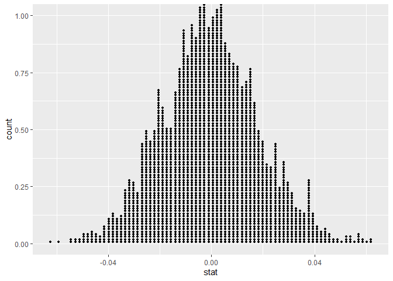<!-- -->


```r
BaromDiffPerm <- cbind(null_FH, diff_orig)
```


```r
# Plot des différences permutées
ggplot(BaromDiffPerm, aes(x = stat)) + 
  # Add a density layer
  geom_density() +
  # vline avec l'interception des valeurs
  geom_vline(aes(xintercept = obs_diff_prop), color = "red")
```

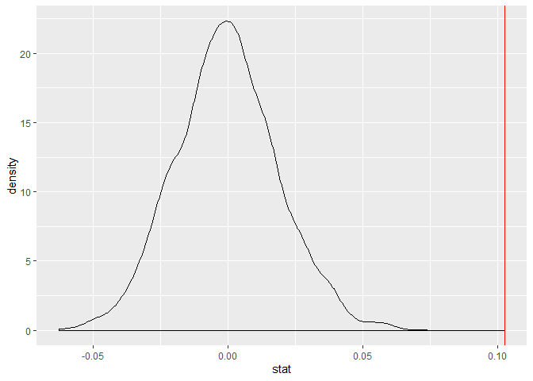<!-- -->


La barre rouge (à droite) permet de rendre compte de la faible probabilité d'occurrence pour cette différence dans une situation aléatoire. En d'autres mots, il est peu probable que cette différence soit due au hasard.  

### Généralisation des résultats : Perception d'une société juste dans l'ensemble de la population

En statistique inférentielle classique, on assume qu'il existe un paramètre d'intérêt fixe mais inconnu. Ici, on peut assumer que ce paramètre est la proportion de l'ensemble de français et de françaises qui considèrent que la société leur semble être plutôt injuste.  

Pour savoir si les résultats que nous observons dans cette enquête sont généralisables à l'ensemble de la population, nous devons capturer l'incertitude dans l'estimation que nous obtenons. Pour cela, nous pouvons calculer un intervalle de confiance à travers la méthode de [bootstrap](https://fr.wikipedia.org/wiki/Bootstrap_(statistiques) ). Pour accomplir cela, nous calculons la probabilité
observée et l'écart type de cette probabilité dans x observations résultant de la méthode de bootstrap. 

Pour appliquer cette méthode, la variable indépendante se doit d'être binaire, raison par laquelle nous commençons par filtrer l'option de réponse "NSP"


```r
library(infer)
# proba
proba2018 <- BMT.JUST_2018 %>%
  filter(SocJuste %in% c("Plutôt injuste", "Plutôt juste"))%>%
  dplyr::summarize(mean(SocJuste == "Plutôt injuste")) %>%
  pull()

# écart type
SE <- BMT.JUST_2018 %>%
  filter(SocJuste %in% c("Plutôt injuste", "Plutôt juste"))%>%
  specify(response = SocJuste, success = "Plutôt injuste") %>%
  generate(reps = 100, type = "bootstrap") %>%
  calculate(stat = "prop") %>%
  dplyr::summarize(sd(stat)) %>%
  pull()

# Intervalle de confiance
c(proba2018 - 2 * SE, proba2018 + 2 * SE)
```

```
## [1] 0.7677825 0.7998217
```


Cette méthode nous permet d'inférer, avec 95% de certitude, que la proportion de français et françaises qui estiment que la société française est une société plutôt injuste varie entre 76.9% et 79.8%.  

<style>
div.green { background-color:#ace600; border-radius: 5px; padding: 20px;}
</style>
<div class = "green">

Pour plus d'informations sur le package *infer* et l'analyse inférentielle : 

- [Statistical Inference: A Tidy Approach using R](https://www.youtube.com/watch?v=BCMjVc9ncFo)  

</div>  

<br>
<br>
<br>
<br>


# Conclusion  

Le jeu de données issu de l'enquête Baromètre et Opinion, nous a permis de mettre en lumière les positionnements des personnes enquêtées face à une série de questions relatives à la justice et aux inégalités :

- La société française aujourd'hui, vous paraît-elle plutôt juste ou plutôt injuste ? 
- Globalement, depuis 5 ans, diriez-vous que les inégalités en France...  
- À l'avenir, pensez-vous que les inégalités en France...  
- Quel type d'inégalité vous semble la plus répandue aujourd'hui ?  
- Quel type d'inégalité vous semble la moins acceptable ?  
- Avez-vous le sentiment que les inégalités entre les hommes et les femmes en France sont aujourd'hui...  
- Depuis 10 ans, diriez-vous que les inégalités entre les hommes et les femmes ont plutôt augmenté ou plutôt diminué en France ?  

Nous avons pu analyser les résultats de cette enquête croissant les réponses à ces questions avec des variables telles que le genre, le positionnement politique et la localisation géographique. Les principaux résultats suggèrent qu'au moment de l'enquête : 

- les inégalités étaient perçues comme un phénomène persistant sur le temps et tendant à s'accentuer à l'avenir;  
- Les inégalités les moins acceptables varient en fonction du genre et de la localisation géographique  
- Les inégalités les moins acceptables et les inégalités les plus répandues concernent les revenus  
- Les différences concernant les réponses pour la question « Avez-vous le sentiment que les inégalités entre les hommes et les femmes en France sont aujourd'hui... (Très importantes, Assez importantes, etc.)" diffèrent significativement entre les femmes et les hommes  
- De manière générale, l'inégalité la moins acceptable et la plus répandue, est celle liée au revenus. 
- La société française et perçue comme étant injuste, peu importe le sexe des personnes enquêtées.  

En outre, le jeu de données publié par la DREES contient un nombre important d'indicateurs et de variables pouvant attirer l'attention d'autres analystes. Parmi ces variables on retrouve, par exemple :  

- « Si des personnes se trouvent en situation d'exclusion ou de pauvreté, c'est parce qu'. elles ne veulent pas travailler ? »  
- « Quel est le mode de garde ou d'accueil que vous avez principalement utilisé pour vos enfants ? »  
- « Notre système de sécurité sociale... peut servir de modèle à d'autres pays »  
- « Pour réduire le déficit de la branche maladie de la Sécurité sociale, seriez-vous plutôt favorable ou opposé.e à. taxer davantage les fabricants de médicaments ? »  

<br>
<br>
<br>
<br>  

<center>  

---------------------------------------------------------  

FOST-Project (2020)  
LICENCE: MIT    
  
  
R version 3.6.2 (2019-12-12)  
Platform: x86_64-w64-mingw32/x64 (64-bit)  
Running under: Windows 10 x64 (build 18362)  

---------------------------------------------------------  

<center>  


Pour apporter des modifications au document, rdv à:  

https://github.com/AnotherDataGuy/JusticeIneg_FR  

<center>  
